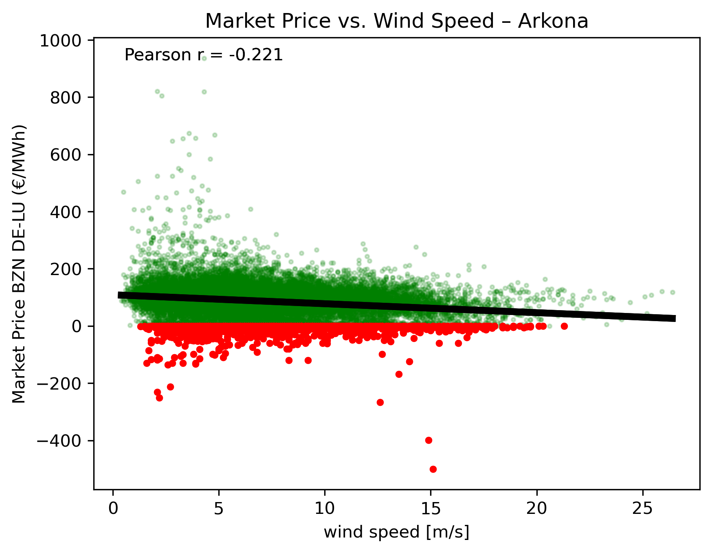
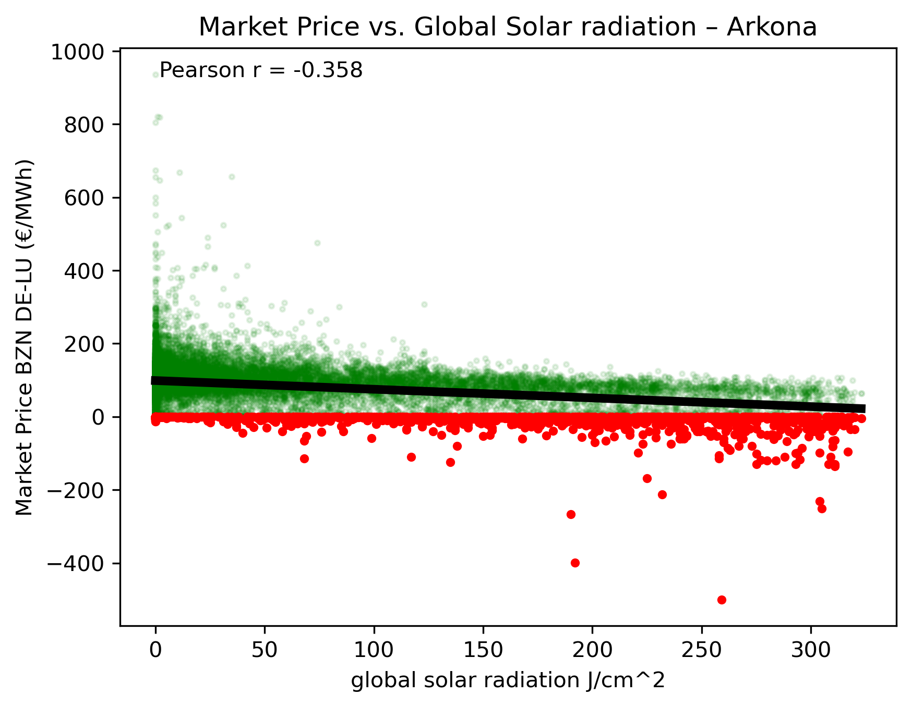

# Renewables To Price

Comparing electricity market prices with observational wind & solar data from four observation stations in Germany.

The goal is to evaluate whether observations of wind speed and global solar radiation show correlation with the German Day-Ahead Market Price (DE-LU).

## 1. Hypothesis and Research Question

Is it possible to detect a recognizable correlation between meteorological data (in this case: wind speed and global solar radiation) and the market price for electricity, in the sense of the Merit-Order Effect, whereby high renewable power input into the grid leads to lower energy prices?

## 2. Data Sources

- **Wind & Solar**: DWD Open Data, hourly observational data from four stations in Germany:
  - Arkona (northernmost)
  - Aachen (westernmost)
  - Görlitz (easternmost)
  - Zugspitze (southernmost, substitute for Oberstdorf, which would actually be the southernmost station but does not provide solar data)
- **Electricity Price**: EnergyCharts API, Day-Ahead Price for bidding zone DE-LU
- **Time period**: 01.01.2023 – 31.12.2025 (hourly)

## 3. Methodology

### Preparing the Data

- **Missing values**: the market price series has no missing data (`NaN`); DWD data does (marked as `-999`, flagged in code as `NaN`)
  - Time-based interpolation is applied, but only for gaps of three or fewer consecutive timestamps (hours)
  - Longer, systematic gaps are deliberately left as `NaN` — no artificial smoothing of the values
- **Time zone correction**: market price and wind data are given in UTC; solar data requires a conversion from WOZ (true local time) to UTC
  - Timestamps in the solar data are converted to UTC based on longitude offset and the equation of time
  - Timestamps are then rounded to the nearest hour to establish a consistent time basis for comparison with wind data and electricity prices
- **Duplicate timestamps** in the index (e.g. as a result of the time zone correction) are checked with a script-bound diagnostic tool and ultimately cleaned
  - If the function detects a duplicated timestamp with differing values, it raises a warning and a manual check by the user is required
- Wind and solar data are joined per station on the timestamp (outer join, so `NaN` values remain visible rather than being dropped)

### Analysis

- Time series and scatter plots
- Pearson correlation between wind/solar data and electricity price, for each station
- Separate analysis of hours with negative electricity prices
  - Comparing average wind/solar values during hours with negative prices against the overall average

## 4. Results

| Station | wind_corr | solar_corr | negative_hours | negative_share (%) | mean_wind_negative | mean_solar_negative | mean_wind_total | mean_solar_total |
|---|---|---|---|---|---|---|---|---|
| Arkona | -0.22 | -0.36 | 1333 | 5.07 | 8.51 | 156.06 | 6.83 | 47.47 |
| Aachen | -0.34 | -0.34 | 1333 | 5.07 | 6.39 | 159.56 | 4.63 | 46.92 |
| Görlitz | -0.27 | -0.37 | 1333 | 5.07 | 5.03 | 162.31 | 3.65 | 48.26 |
| Zugspitze | -0.13 | -0.35 | 1333 | 5.07 | 6.27 | 175.58 | 6.26 | 55.19 |

*Note: `negative_hours` and `negative_share` are identical across all four stations, since the electricity price is a single nationwide time series across the bidding zone DE-LU — the prices are therefore not station-specific.*




## 5. Interpretation

- All stations show a negative correlation between wind/solar observations and electricity price
  - This aligns with the merit-order hypothesis: higher renewable power input through PV or wind turbines correlates with lower energy prices
- Correlation strength is weak to moderate (between 0.13–0.37) — not a strong relationship, but a recognizable pattern
- The solar effect is more pronounced than the wind effect (except for Aachen, where they are about the same)
  - Solar input is concentrated during the day (mainly around noon), which results in a sharp midday peak occurring simultaneously across all of Germany
  - Wind input is more spatially distributed and more evenly spread throughout the day
- There is a particularly strong relationship between energy prices and wind/solar data during hours with negative prices:
  - 5.07% of all hours (1,333 hours over the studied period) show negative prices
  - Average solar radiation during these hours is 2.7–3.3 times higher than the overall average, depending on the station
  - Wind speed is also usually higher during these hours, but less pronounced (roughly 1.0–1.4 times higher)

## 6. Limitations

- **Point measurements as a proxy**: the four chosen stations represent measured weather at four corners of Germany, not the actual nationwide wind/solar power input that drives the DE-LU price
  - The relationship between weather and energy prices should be understood as an indicator of large-scale weather patterns, rather than direct causal evidence at these four locations
- **Forecast vs. actuals**: Day-ahead prices are calculated based on forecasts from the previous day. This analysis uses actual, measured data. Forecasts and actuals usually correlate strongly, but this is not evidence of the price formation mechanism itself
- **Correlation analysis only**: the results presented show statistical associations, not a controlled, multivariate causal analysis. Wind and solar are not independent of each other in the dataset (e.g. due to shared weather patterns), so individual correlations do not net out the other variable's effect

## 7. Possible Next Steps

- Multiple regression (wind & solar combined)
- Comparison against actual nationwide wind/solar energy input
- Statistical significance testing
- Accounting for time lag between weather and price

## 8. Reproducibility

### Project Structure

```
.
├── src/
│   ├── observations.py   # Loading, cleaning, and interpolating wind/solar data per station
│   ├── marketprice.py    # Entry point for the market data
│   └── main.py            # Visualisation and analysis of joined observations & market data
├── DWD Data/
│   ├── wind/              # Raw wind observation files, as referenced in the script
│   └── solar/             # Raw solar observation files, as referenced in the script
├── plots/                  # Resulting plots
├── results/                 # Table of results
└── README.md
```

### Requirements

- Python 3.9+
- pandas
- numpy
- requests
- matplotlib

```bash
pip install pandas numpy requests matplotlib
```


